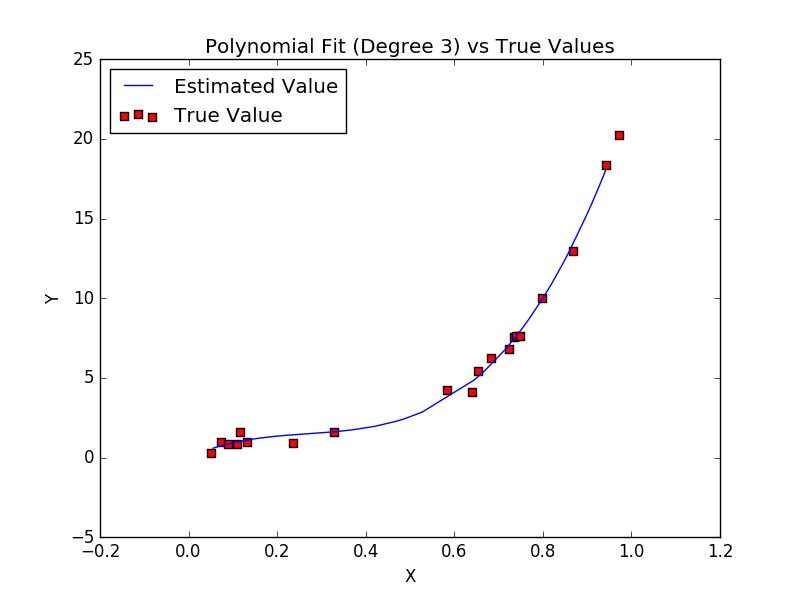

# PolyFit
A regression model to fit polynomials on data

Run the program as 
> python main.py

Provide data points as input in the input.txt file.
A sample input file has been shown below
<pre>
0.051 0.287
0.073 0.983
0.089 0.857
0.798 9.997
0.943 18.345
0.684 6.233
0.132 0.994
0.723 6.805
0.110 0.845
0.117 1.578
0.641 4.122
0.329 1.633
0.654 5.462
0.749 7.621
0.583 4.249
0.740 7.610
0.235 0.935
0.735 7.564
0.971 20.224
0.867 12.940
</pre>
The input has to be in the form of 'x y'

The output will be saved to output.txt  and a plot to Plot.png
